<div align="center">



<br><br>

<h3><code>entisone@github ~ $ ./contributions.sh</code></h3>


<br><br>

<h3><code>entisone@github ~ $ whoami</code></h3>
<table>
  <tr>
    <td valign="top"></td>
    <td valign="top"></td>
  </tr>
</table>

<br>

**I build web products that load fast and get found.**

Web developer in Pangasinan, PH · `4+ years` · `10+ clients` · `11 projects shipped`

</div>

<br>

### `$ about`

**Ex-DBA who moved to the front end.**

I spent three years keeping databases and records straight before I wrote websites
full-time. It shows in how I build: structured data, real constraints, and pages that
stay fast once they're full of content.

Four years of Vue, Laravel and Next.js builds for clients — front-end through database,
with SEO and Core Web Vitals treated as part of the job, not an afterthought.

Currently **open to freelance projects and full-time roles**.

<br>

### `$ skills`

```text
languages  : HTML, CSS, JavaScript, TypeScript, PHP
frameworks : Vue.js, Laravel, Next.js, Tailwind CSS
tools      : Git, WordPress, Dealer CMS, DealerOn, SchemaApp, Ahrefs
focus      : On-page SEO, Performance, Responsive UI, CMS customisation, Databases
```

<br>

### `$ work`

Live, right now — real sites, go poke at them.

| Project | Stack | What it is |
|---|---|---|
| **[Snail App](https://dazzling-cendol-1d26e9.netlify.app/)** | Next.js · Tailwind | Marketing site for a collect-and-upgrade game, built to load fast on mobile and convert cold paid traffic |
| **[Custom Pokédex](https://pokedex-v1-five.vercel.app)** | Vue 3 · TypeScript · Vite | Every generation on a custom data layer, with instant search and filtering across ~1000 entries |
| **[Mac OS](https://windows-portfolio-nine.vercel.app/)** | Vue 3 · TypeScript · Vite | A portfolio that recreates the Mac OS desktop — draggable windows, working taskbar, file explorer |
| **[Frame Quest](https://cine-vault-khaki.vercel.app/)** | Vue 3 · TypeScript · Vite | Discovery app for movies, series and anime from one fast, keyboard-friendly interface |
| **[Mini Cozy Game](https://3d-room-henna.vercel.app/)** | Vue 3 · three.js · Vite | A small interactive 3D room — a for-fun experiment in rendering a scene in the browser |

<br>

### `$ work --private`

Client work under NDA and projects still in progress — no live demo, so here's what they
actually are.

| Project | Stack | Status |
|---|---|---|
| **Water Billing Management System** | PHP · MySQL · Bootstrap | `client · private` |
| **Crypto Investment Landing Page** | Next.js · TypeScript · Tailwind | `client · private` |
| **Spacefy** | Next.js · PHP · MySQL | `client · private` |
| **Sisiw Bot** | Discord.js · Node.js | `shipped` |
| **Coffee Shop POS** | Laravel · Vue · Stripe | `in progress` |
| **CineVault** | Vue · Node.js | `in progress` |
| **MH Bestiary** | Vue · Custom API | `in progress` |

<details>
<summary>What they are</summary>

<br>

- **Water Billing Management System** — Billing platform for a Local Water District: automated bill calculation, customer records and payment tracking, replacing a manual ledger process.
- **Crypto Investment Landing Page** — Conversion-focused landing page for paid acquisition, with live price tickers and sub-1.5s loads on mobile.
- **Spacefy** — NFT marketplace for digital artists and collectors, built on Next.js with a custom WordPress-backed NFT plugin.
- **Sisiw Bot** — Discord bot serving Monster Hunter Wilds data: monster stats, weaknesses and drop tables, via the MH Wilds API.
- **Coffee Shop POS** — Laravel commerce boilerplate: product catalogue, cart, Stripe checkout and an admin panel.
- **CineVault** — Movie and TV discovery interface with a fast, keyboard-friendly browse experience.
- **MH Bestiary** — A Monster Hunter bestiary covering the whole series, backed by a custom aggregated API.

</details>

<br>

### `$ experience`

| Role | Period |
|---|---|
| **Web Developer** — Contract | `Jan 2026 – Feb 2026` |
| **Junior Web Developer** | `Nov 2023 – Mar 2025` |
| **Freelance Web Developer** | `Nov 2021 – Nov 2023` |
| **Database Administrator** | `Feb 2020 – Mar 2023` |

<details>
<summary>The details</summary>

<br>

**Web Developer — Contract** · Jan 2026 – Feb 2026
- Delivered two production-ready projects inside the first month
- Built responsive UI components and wired backend integrations

**Junior Web Developer** · Nov 2023 – Mar 2025
- Ran on-page SEO across client sites and lifted search rankings
- Built and customised WordPress and Dealer CMS sites to spec
- Improved mobile usability and responsiveness across platforms

**Freelance Web Developer** · Nov 2021 – Nov 2023
- Designed and shipped custom sites with clean, maintainable code
- Built crypto landing pages in Next.js for paid acquisition
- Cut load times through code and asset optimisation

**Database Administrator** · Feb 2020 – Mar 2023
- Maintained and tuned database systems across branches
- Diagnosed and resolved issues to keep systems reliable

</details>

<br>

### `$ services`

```text
01  Web development     Vue & Next.js front-ends, Laravel & PHP back-ends,
                        REST APIs and integrations. Code that survives handover.

02  SEO & performance   On-page and technical SEO, Core Web Vitals,
                        schema and analytics. Faster pages, better rankings.

03  CMS & maintenance   WordPress and Dealer CMS builds, themes and plugins,
                        plus the ongoing care that keeps a site fast and current.
```

<br>

### `$ socials`

```text
website   : oneentis.dev
email     : oneentis@gmail.com
github    : github.com/entisone
linkedin  : in/j-francis-fabia
```

**[oneentis.dev](https://www.oneentis.dev)** ·
**[oneentis@gmail.com](mailto:oneentis@gmail.com)** ·
**[LinkedIn](https://www.linkedin.com/in/j-francis-fabia)**

Open to freelance projects, full-time roles and collaborations. I usually reply within 24h.

<br>

### `$ ./profile-art.sh --help`

This README builds itself. Everything at the top is **animated SVG** generated by Python
and committed to this repo — no third-party stats services, no GitHub token, no
JavaScript.

The constraint that shapes it: GitHub strips `<script>` from READMEs and sanitizes
almost all inline CSS, but it *does* render SVGs embedded via `` and runs their
SMIL and CSS-keyframe animations. So all the motion lives inside the SVG files, and the
README just places them.

| Script | Does what |
|---|---|
| [`make_banner_svg.py`](scripts/make_banner_svg.py) | Neon signature banner — procedural wobbly border, starfield, gradient name |
| [`prep_photo.py`](scripts/prep_photo.py) | Cuts out the background, crops to head-and-shoulders, boosts local contrast with CLAHE |
| [`make_ascii_svg.py`](scripts/make_ascii_svg.py) | Maps brightness onto a density ramp, wipes each row in with a block cursor |
| [`make_info_card.py`](scripts/make_info_card.py) | Hand-authored neofetch-style panel, staggered fade-in |
| [`fetch_contributions.py`](scripts/fetch_contributions.py) | Scrapes the public contribution calendar — no auth |
| [`render_heatmap_svg.py`](scripts/render_heatmap_svg.py) | Draws the 53×7 grid, revealed on a diagonal |

The heatmap refreshes daily at 06:17 UTC via
[GitHub Actions](.github/workflows/update-profile-art.yml). The banner, portrait and
info card are static — regenerate them only when the photo or the details change. The
banner needs no dependencies at all; it's pure standard library.

<details>
<summary><b>Rebuild it yourself</b></summary>

<br>

```bash
python -m venv .venv && source .venv/bin/activate
pip install -r scripts/requirements.txt          # daily: requests + beautifulsoup4
pip install -r scripts/requirements-portrait.txt # photo pipeline only
```

```bash
python scripts/make_banner_svg.py
python scripts/prep_photo.py source-photo.jpg    # --frame head | bust | full
python scripts/make_ascii_svg.py
python scripts/make_info_card.py
python scripts/fetch_contributions.py
python scripts/render_heatmap_svg.py
```

Set `STATIC=1` on any of the generators to emit a frozen frame instead of an animated
one — useful for previewing locally, where you can't watch the animation play.

Credit: the approach follows
[this write-up by Avi Vashishta](https://www.avivashishta.com/blog/build-animated-github-profile-readme).

</details>

<br>

<div align="center">
<sub><code>entisone@github ~ $ exit</code></sub>
</div>
