<div align="center">


<br><br>

<a href="#about"><b>About</b></a> &nbsp;·&nbsp;
<a href="#skills"><b>Skills</b></a> &nbsp;·&nbsp;
<a href="#work"><b>Work</b></a> &nbsp;·&nbsp;
<a href="#experience"><b>Experience</b></a> &nbsp;·&nbsp;
<a href="#services"><b>Services</b></a> &nbsp;·&nbsp;
<a href="#socials"><b>Socials</b></a>

<br><br>

<h3><code>entisone@github ~ $ ./contributions.sh</code></h3>


<br><br>

<h3><code>entisone@github ~ $ whoami</code></h3>
<table>
  <tr>
    <td valign="top"></td>
    <td valign="top"></td>
  </tr>
</table>

<br>

**I build web products that load fast and get found.**

Web developer in Pangasinan, PH · `4+ years` · `10+ clients` · `11 projects shipped`

</div>

<br>

<h3 id="about"><code>$ about</code></h3>

**Ex-DBA who moved to the front end.**

I spent three years keeping databases and records straight before I wrote websites
full-time. It shows in how I build: structured data, real constraints, and pages that
stay fast once they're full of content.

Four years of Vue, Laravel and Next.js builds for clients — front-end through database,
with SEO and Core Web Vitals treated as part of the job, not an afterthought.

Currently **open to freelance projects and full-time roles**.

<br>

<h3 id="skills"><code>$ skills</code></h3>

<div align="center">

</div>

<br>

<details>
<summary><b>languages</b> — HTML, CSS, JavaScript, TypeScript, PHP</summary>

<br>

| | |
|---|---|
| **HTML / CSS** | Semantic markup and responsive, mobile-first layout — the base under every project here |
| **JavaScript / TypeScript** | The day-to-day language for Vue and Next.js work; TypeScript wherever the project allows it |
| **PHP** | Laravel back-ends, WordPress themes and plugins, and the custom CMS work that comes with them |

</details>

<details>
<summary><b>frameworks</b> — Vue.js, Laravel, Next.js, Tailwind CSS</summary>

<br>

| | |
|---|---|
| **Vue.js** | Primary front-end framework — Vue 3 + Vite across most of the live projects below |
| **Laravel** | PHP back-ends, from billing systems to commerce boilerplate |
| **Next.js** | Static and server-rendered marketing sites where first-visit load speed is the point |
| **Tailwind CSS** | Utility-first styling on the Next.js builds |

</details>

<details>
<summary><b>tools</b> — Git, WordPress, Dealer CMS, DealerOn, SchemaApp, Ahrefs</summary>

<br>

| | |
|---|---|
| **Git** | Version control on everything, including the SVG art in this repo |
| **WordPress** | Custom themes and plugins, including a WordPress-backed NFT plugin |
| **Dealer CMS / DealerOn** | Dealership sites built and customised to client spec |
| **SchemaApp** | Structured data and rich-result markup |
| **Ahrefs** | Keyword research and rank tracking for the SEO work |

</details>

<details>
<summary><b>focus</b> — On-page SEO, Performance, Responsive UI, CMS customisation, Databases</summary>

<br>

| | |
|---|---|
| **On-page SEO** | Technical and on-page work that measurably lifted client rankings |
| **Performance** | Core Web Vitals, asset and code optimisation, sub-1.5s mobile loads |
| **Responsive UI** | Mobile-first layouts and usability across platforms |
| **CMS customisation** | Themes, plugins and admin surfaces clients can actually operate |
| **Databases** | Three years as a DBA — schema design, tuning, and keeping records straight |

</details>

<br>

<h3 id="work"><code>$ work</code></h3>

Live, right now — real sites, go poke at them.

| Project | Stack | What it is |
|---|---|---|
| **[Snail App](https://dazzling-cendol-1d26e9.netlify.app/)** | Next.js · Tailwind | Marketing site for a collect-and-upgrade game, built to load fast on mobile and convert cold paid traffic |
| **[Custom Pokédex](https://pokedex-v1-five.vercel.app)** | Vue 3 · TypeScript · Vite | Every generation on a custom data layer, with instant search and filtering across ~1000 entries |
| **[Mac OS](https://windows-portfolio-nine.vercel.app/)** | Vue 3 · TypeScript · Vite | A portfolio that recreates the Mac OS desktop — draggable windows, working taskbar, file explorer |
| **[Frame Quest](https://cine-vault-khaki.vercel.app/)** | Vue 3 · TypeScript · Vite | Discovery app for movies, series and anime from one fast, keyboard-friendly interface |
| **[Mini Cozy Game](https://3d-room-henna.vercel.app/)** | Vue 3 · three.js · Vite | A small interactive 3D room — a for-fun experiment in rendering a scene in the browser |

<details>
<summary><b>Client work under NDA and projects in progress</b> — 7 more</summary>

<br>

| Project | Stack | Status |
|---|---|---|
| **Water Billing Management System** | PHP · MySQL · Bootstrap | `client · private` |
| **Crypto Investment Landing Page** | Next.js · TypeScript · Tailwind | `client · private` |
| **Spacefy** | Next.js · PHP · MySQL | `client · private` |
| **Sisiw Bot** | Discord.js · Node.js | `shipped` |
| **Coffee Shop POS** | Laravel · Vue · Stripe | `in progress` |
| **CineVault** | Vue · Node.js | `in progress` |
| **MH Bestiary** | Vue · Custom API | `in progress` |

- **Water Billing Management System** — Billing platform for a Local Water District: automated bill calculation, customer records and payment tracking, replacing a manual ledger process.
- **Crypto Investment Landing Page** — Conversion-focused landing page for paid acquisition, with live price tickers and sub-1.5s loads on mobile.
- **Spacefy** — NFT marketplace for digital artists and collectors, built on Next.js with a custom WordPress-backed NFT plugin.
- **Sisiw Bot** — Discord bot serving Monster Hunter Wilds data: monster stats, weaknesses and drop tables, via the MH Wilds API.
- **Coffee Shop POS** — Laravel commerce boilerplate: product catalogue, cart, Stripe checkout and an admin panel.
- **CineVault** — Movie and TV discovery interface with a fast, keyboard-friendly browse experience.
- **MH Bestiary** — A Monster Hunter bestiary covering the whole series, backed by a custom aggregated API.

</details>

<br>

<h3 id="experience"><code>$ experience</code></h3>

| Role | Period |
|---|---|
| **Web Developer** — Contract | `Jan 2026 – Feb 2026` |
| **Junior Web Developer** | `Nov 2023 – Mar 2025` |
| **Freelance Web Developer** | `Nov 2021 – Nov 2023` |
| **Database Administrator** | `Feb 2020 – Mar 2023` |

<details>
<summary><b>Web Developer — Contract</b> &nbsp;·&nbsp; <code>Jan 2026 – Feb 2026</code></summary>

<br>

- Delivered two production-ready projects inside the first month
- Built responsive UI components and wired backend integrations
- Collaborated with the team to meet tight project deadlines

</details>

<details>
<summary><b>Junior Web Developer</b> &nbsp;·&nbsp; <code>Nov 2023 – Mar 2025</code></summary>

<br>

- Ran on-page SEO across client sites and lifted search rankings
- Built and customised WordPress and Dealer CMS sites to spec
- Improved mobile usability and responsiveness across platforms
- Collaborated cross-functionally to ship new features

</details>

<details>
<summary><b>Freelance Web Developer</b> &nbsp;·&nbsp; <code>Nov 2021 – Nov 2023</code></summary>

<br>

- Designed and shipped custom sites with clean, maintainable code
- Built crypto landing pages in Next.js for paid acquisition
- Cut load times through code and asset optimisation

</details>

<details>
<summary><b>Database Administrator</b> &nbsp;·&nbsp; <code>Feb 2020 – Mar 2023</code></summary>

<br>

- Maintained and tuned database systems across multiple branches
- Diagnosed and resolved technical issues to keep systems reliable
- Streamlined troubleshooting to improve operational efficiency

</details>

<br>

<h3 id="services"><code>$ services</code></h3>

<details>
<summary><b><code>01</code> &nbsp;Web development</b> — Vue & Next.js front-ends, Laravel & PHP back-ends</summary>

<br>

Responsive, accessible sites and apps built with code that survives handover.

- Vue & Next.js front-ends
- Laravel & PHP back-ends
- REST APIs & integrations

</details>

<details>
<summary><b><code>02</code> &nbsp;SEO & performance</b> — Core Web Vitals, on-page and technical SEO</summary>

<br>

Faster pages and better rankings through on-page work and Core Web Vitals.

- On-page & technical SEO
- Core Web Vitals
- Schema & analytics

</details>

<details>
<summary><b><code>03</code> &nbsp;CMS & maintenance</b> — WordPress, custom themes, ongoing support</summary>

<br>

Custom CMS builds plus the ongoing care that keeps a site fast and current.

- WordPress & Dealer CMS
- Themes & plugins
- Updates & support

</details>

<br>

<h3 id="socials"><code>$ socials</code></h3>

<div align="center">

[](https://www.oneentis.dev)
[](mailto:oneentis@gmail.com)
[](https://github.com/entisone)
[](https://www.linkedin.com/in/j-francis-fabia)

</div>

Open to freelance projects, full-time roles and collaborations. I usually reply within 24h.

<br>

<h3 id="how"><code>$ ./profile-art.sh --help</code></h3>

This README builds itself. Every image on this page is **SVG generated by Python** and
committed to this repo — no third-party stats or badge services, no GitHub token, no
JavaScript.

The constraint that shapes it: GitHub strips `<script>` from READMEs, sanitizes almost
all inline CSS, and drops inline `<svg>` — but it *does* render SVGs embedded via
`` and runs their SMIL and CSS-keyframe animations. So all the motion lives inside
the SVG files, and the README just places them.

That also sets the ceiling on interactivity here: no hover states (an `` gets no
pointer events inside it) and no scripted tabs. What actually works is native HTML —
the `<details>` accordions above, anchor links, and clickable images. That's what the
sections use.

| Script | Does what |
|---|---|
| [`make_banner_svg.py`](scripts/make_banner_svg.py) | Neon signature banner — procedural wobbly border, starfield, gradient name |
| [`make_badges_svg.py`](scripts/make_badges_svg.py) | Social pills and the skills chip grid |
| [`prep_photo.py`](scripts/prep_photo.py) | Cuts out the background, crops to head-and-shoulders, boosts local contrast with CLAHE |
| [`make_ascii_svg.py`](scripts/make_ascii_svg.py) | Maps brightness onto a density ramp, wipes each row in with a block cursor |
| [`make_info_card.py`](scripts/make_info_card.py) | Hand-authored neofetch-style panel, staggered fade-in |
| [`fetch_contributions.py`](scripts/fetch_contributions.py) | Scrapes the public contribution calendar — no auth |
| [`render_heatmap_svg.py`](scripts/render_heatmap_svg.py) | Draws the 53×7 grid, revealed on a diagonal |

The heatmap refreshes daily at 06:17 UTC via
[GitHub Actions](.github/workflows/update-profile-art.yml). Everything else is static —
regenerate it when the photo or the details change. Only the portrait needs
dependencies; the banner, pills and chips are pure standard library.

<details>
<summary><b>Rebuild it yourself</b></summary>

<br>

```bash
python -m venv .venv && source .venv/bin/activate
pip install -r scripts/requirements.txt          # daily: requests + beautifulsoup4
pip install -r scripts/requirements-portrait.txt # photo pipeline only
```

```bash
python scripts/make_banner_svg.py
python scripts/make_badges_svg.py
python scripts/prep_photo.py source-photo.jpg    # --frame head | bust | full
python scripts/make_ascii_svg.py
python scripts/make_info_card.py
python scripts/fetch_contributions.py
python scripts/render_heatmap_svg.py
```

Set `STATIC=1` on any of the generators to emit a frozen frame instead of an animated
one — useful for previewing locally, where you can't watch the animation play.

Credit: the approach follows
[this write-up by Avi Vashishta](https://www.avivashishta.com/blog/build-animated-github-profile-readme).

</details>

<br>

<div align="center">
<sub><code>entisone@github ~ $ exit</code></sub>
</div>
